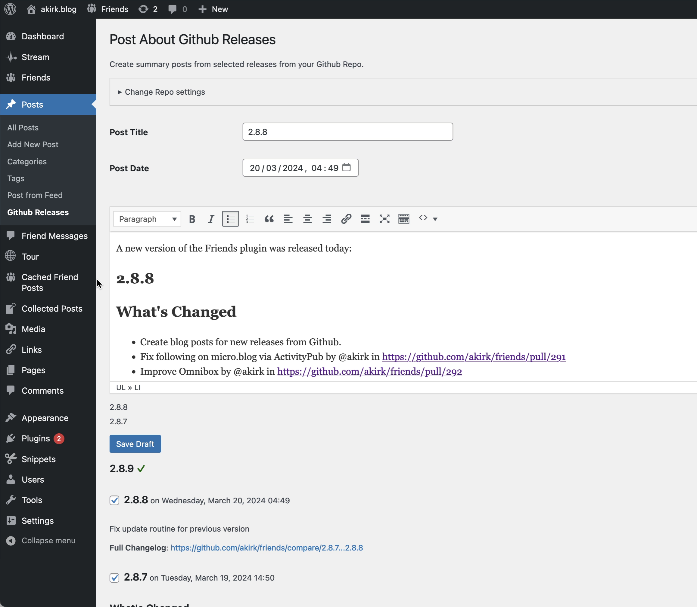

# Post about Github Releases

- Contributors: akirk
- Tags: github, release
- Requires at least: 5.0
- Tested up to: 6.5
- License: [GPLv2 or later](http://www.gnu.org/licenses/gpl-2.0.html)
- Stable tag: 1.0.0

Create blog posts for new releases from Github.

## Description

Find this plugin under Posts > Github Releases.

1. You'll first need to set the Github repository for which you want to post about releases.
2. Then you'll see the releases and can click a checkbox to add them to the post.
3. It will remember the releases you have already posted about.

